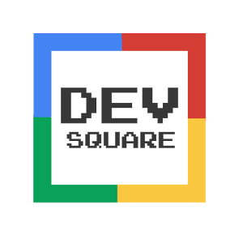

# GDG Game - DevSquare

[](https://waffle.io/Bigotter/gdggame?utm_source=badge)



Assume your role as GDG local community organizer and slide your leader fingers to left or right to take significant decisions about events and the local community you belong to.
Honor your assistants and build trustworthy relationships with sponsors and speakers. Be careful, every decision you take might leave you to any path!

Every level will gain into complexity as an organizer but also will enlighten hidden lessons about GDG organization issues.

## Download and play!

[](https://play.google.com/store/apps/details?id=com.biggoter.gdggame)

## License

This repository is under the [Apache Version 2.0](LICENSE) license.

```
Licensed under the Apache License, Version 2.0 (the "License");
you may not use this file except in compliance with the License.
You may obtain a copy of the License at

    http://www.apache.org/licenses/LICENSE-2.0

Unless required by applicable law or agreed to in writing, software
distributed under the License is distributed on an "AS IS" BASIS,
WITHOUT WARRANTIES OR CONDITIONS OF ANY KIND, either express or implied.
See the License for the specific language governing permissions and
limitations under the License.
```
